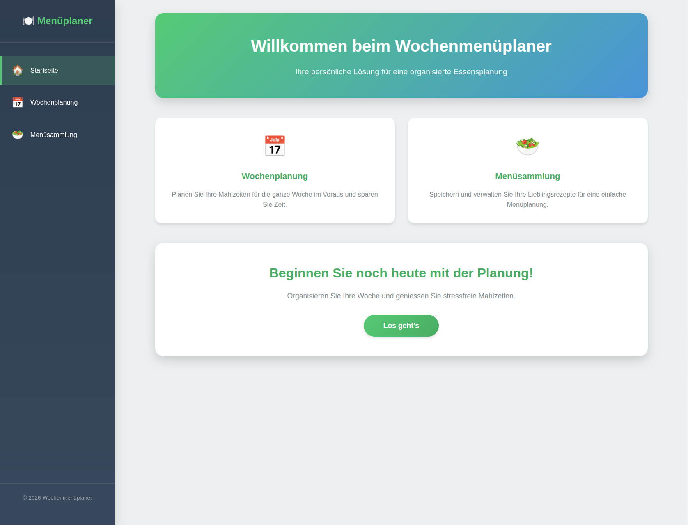
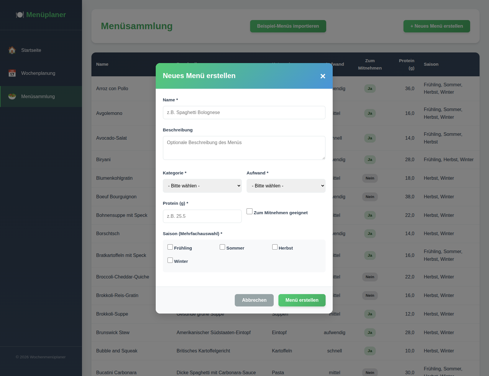
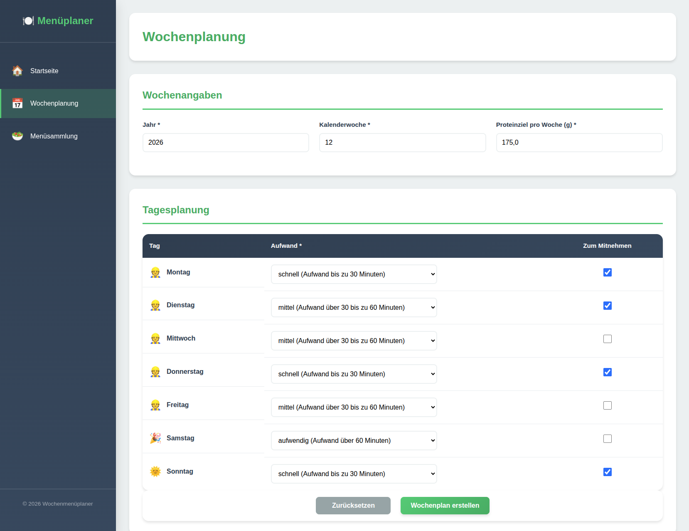
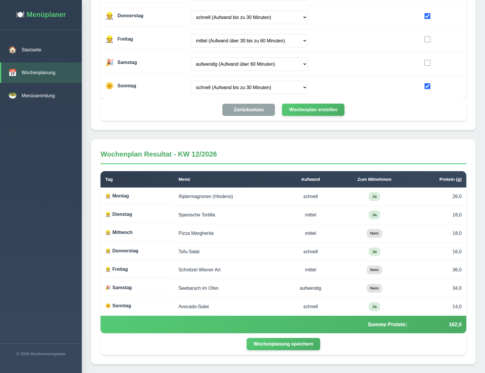

# lap_project_menu_planner

## TEKO LAP Project Work Weekly Menu Planner

### Introduction and brief overview of the concept

This project was developed as part of a project assignment in the subject ‘Solution Algorithms and Programming’ at TEKO in Lucerne.

The focus is on algorithms.

The aim of this project is to create an automatic menu plan for a week based on recorded menus.  
Various specifications can be made for the planning.  
These are taken into account during planning and a suggestion is made.

The planning takes into account:

- Available cooking time
- Pre-cooking for the following day
- Achieving a weekly protein target
- No repetition of menus within the last 4 weeks
- No repetition of the same categories per week

### Implementation

The project is largely written in Python.  
Python 3.14 is currently being used.
The following libraries are used to provide a GUI.

- FastAPI
- Pydantic
- SQLModel
- Jinja

### Setting up the environment with VSCode

Python must be installed (3.14 or higher).  
VSCode extensions

- Python
- Pylint
- Python Debugger
- Black Formatter

Create a virtual environment with VENV.  
Install the enclosed libraries from `requirement.txt`.

```bash
pip install -r requirements.txt
```

To activate the virtual environment, run the following command in the terminal:

```bash
source /<path_to_your_project>/.venv/bin/activate
```

To start the devlopment server, run the following command in the terminal:

```bash
fastapi dev main.py --host 127.0.0.1 --port 8480
```

Or direct from VSCode, click on the green play button in the top right corner of the editor.


To start the production server, run the following command in the terminal:

```bash
fastapi run main.py --host 127.0.0.1 --port 8480
```

Start the week planner in the browser by navigating to http://127.0.0.1:8480

### Screenshots of the application

  
Overview of the main page.  
From here you can navigate to the menu collection and the week planner.

  
Menu collection page.  
Here you can see the recorded menus and add new ones.

  
Week planner settings page.  
Here you can configure the settings for the week planner.

  
Week planner result page.  
Here you can see the generated week plan.
